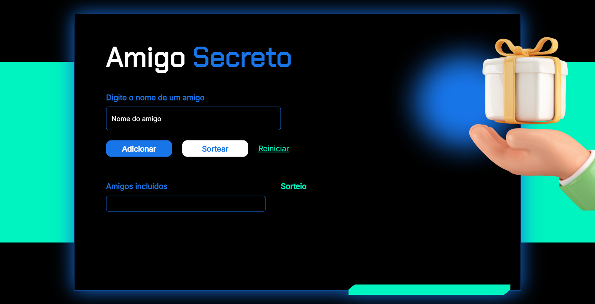

# Amigo Secreto - Desafio Alura

---

## Menu

- [Layout](#layout)
- [Descrição](#descrição)
  - [Principais recursos incluem](#principais-recursos-incluem)
- [Tecnologias Utilizadas](#tecnologias-utilizadas)
- [Estrutura de Pastas](#estrutura-de-pastas)
  - [Arquivos Principais](#arquivos-principais)
- [Como Instalar e Rodar o Projeto](#como-instalar-e-rodar-o-projeto)
  - [Configuração](#configuração)
  - [Casos de Uso Comuns](#casos-de-uso-comuns)
  - [Solução de Problemas](#solução-de-problemas)
- [Projeto ao Vivo](#projeto-ao-vivo)
- [Licença](#licença)
- [Autor](#autor)

---

## Layout



---

## Descrição

### Principais recursos incluem

---

## Tecnologias Utilizadas

---

## Estrutura de Pastas

```plaintext
amigo-secreto/
├── assets/                     # Pasta de assets
|   └── imagem-presente.png     # Imagem de presente
├── js/                         # Scripts
|   └── app.js                  # Script com as funções do projeto
├── screenshot/                 # Screenshot
|   └── tela-principal.png      # Print do Projeto
├── index.html                  # Página principal
├── LICENSE                     # Arquivo de LICENÇA MIT
├── README.md                   # Arquivo README do projeto
└── style.css               # Estilo do projeto
```

### Arquivos Principais

---

## Como Instalar e Rodar o Projeto

### Configuração

1. Clone o repositório:

```bash
git clone https://github.com/Melksedeque/amigo-secreto-alura.git
```

2. Abra o arquivo index.html no navegador.

### Casos de Uso Comuns

### Solução de Problemas

---

## Projeto ao Vivo

Você pode ver o projeto ao vivo neste link: [https://melksedeque.github.io/amigo-secreto-alura/](https://melksedeque.github.io/amigo-secreto-alura/)

---

## Licença

Este projeto está licenciado sob a Licença MIT. Veja o arquivo [LICENSE](https://github.com/Melksedeque/amigo-secreto-alura?tab=MIT-1-ov-file) para mais detalhes.

---

## Autor

- GitHub - [Melksedeque Silva](https://github.com/Melksedeque/)
- FrontEndMentor - [@Melksedeque](https://www.frontendmentor.io/profile/Melksedeque)
- Twitter / X - [@SouzaMelk](https://x.com/SouzaMelk)
- LinkedIn - [Melksedeque Silva](https://www.linkedin.com/in/melksedeque-silva/)
